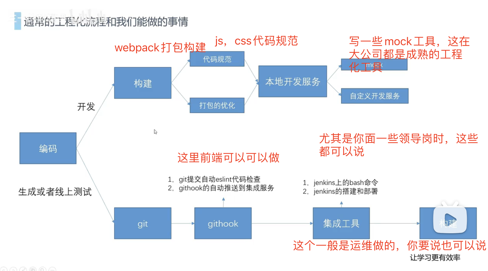
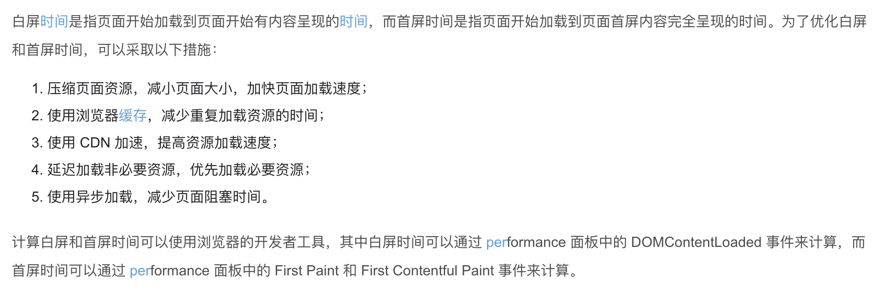

 ## 首先按项目来划分
- 移动端项目(微信小程序，h5页面)
- B端项目-公司业务后台，数字化办公(业务后台)
- 可视化项目(这个可能稍微少一点)

 ## 哪些方面 （无论哪种项目，基本都能从这三方面作答）
- 具体的业务功能  
  
  如果能命中公司也做的业务，很加分，比如我上家公司做了和图片相关的业务，这家也有，加分
- 基础设施建设  
项目的一些规范啊，一些工程化设施，一些组件等
- 项目的优化

 ## 移动端项目一般可以说的亮点和难点
- 多屏幕适配  
多屏幕适配可以总结一套万能公式，rem或者利用工具px转vw(例如px2viewport)。实在不行的上媒体查询或者js解决
- 高还原要求  
移动端项目通常有非常高的还原度要求，和设计图1px都不能差。这一点可以体现出你的认真和细致
  >这也是为什么考问你1px怎么画

- 五花八门的移动端框架和各种兼容问题  
微信小程序，支付宝小程序，wap端，uniapp等等众多的解决方案和适配兼容问题，
如果你准备查这些点，你可以查一下常见的兼容性问题，

 ## B端项目-公司业务后台，数字化办公
- 一些办公系统，常见一些给政府开发的办公系统，给医院开发的医疗信息系统，各种公司的后台管理系统
1. 文件上传，大文件上传，断点续传(可以在b站 三十的前端课 找下，人家录过)
2. excel，pdf，word预览，导入，导出，在线excel等等
3. 富文本编辑器，二次开发富文本功能  
富文本编辑器不算亮点，如果你二次开发了，才算亮点

 ## 如果是一些可视化项目可以加这些
- 主要是一些公司的数据大屏，一些政府的智慧xxx系统，
  1. 熟悉各种可视化工具echarts，g2,
  2. 画过其中一些比较难的图表比如高度定制的地图，流程图，关系图
  3. 按公司ui设计自定义了图表的风格和样式,形成公司风格的ui图表组件库
  4. 3d可视化绘图

 ## -些可能会用到的难点
1. 即时通讯webscoket,"常见于消息提醒，在线协作
2. webrtc(通话类的，这个比较难了)
3. webgl 3d模型操作
4. 很多canvas功能，比如用原生canvas绘制数据，canvas在线绘图，canvas的图片操作如加滤镜，前端剪裁，压缩，在线标注等等

 ## 一些通用的工作中的亮点
- 有些事情是几乎每个项目都有的，一定程度上能体现出你的水平
1. 项目前端规范定制，并且落实到工程化工具中  

1. 给项目开发一些组件，或者大一点，组件库，一般组件库很少从头开发了  
提示:除非是c端项目。所以我们更多地是基于组件库二次 封装，所以准备好3-4个自己封装组件的案例（可以到up主三十的前端课中抄两个）

 ## 性能优化方案
- 项目性能优化
1. 首屏速度优化-体积体积还是体积

     - 异步引入把一些不是打开渲染必须的js代码，延后加载
     - 利用构建，压缩，tree-shaking  
     这个是王炸
     - gzip
     - 替换一些库，换成更小库，老版本替换新版本，比如vue2是不支持treeshaking的
     - 尽量的不要什么都第三方库

2. 大数据量渲染优化--次渲染一部分是根本

3. 体验优化  
    比如骨架屏，兜底图片，操作反馈
4. 组件可扩展性和易用性优化
5. 优化接口的出错处理，并发处理。让页面响应更快，体验更加  
比如某个页面的接口是串行的，我改成并行了
比如对接口的报错更好的提示

