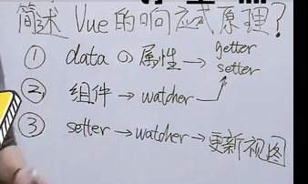

答题技巧

问遇到过什么比较难的项目，怎么解决的
其实是在考察你解决问题的能力
前端并不是难在技术，而是难在业务
解决完了就不难了
可以这么说
遇到过一些比较难的问题，但研究后都能解决了，技术倒没有多难，主要是业务层面比较繁琐，比如直播间要做一个历史消息的功能，
用户可以向上不断翻页去加载之前的消息，下拉后又能和最新的消息续上，做多过程中还遇到了兼容性问题，比如ios上拉回弹后，消息会跳
那就需要加个锁，如果是在回弹阶段，不发送消息请求

简述vue的响应式原理，这么回答才能满分  
1. data的属性被转化尾getter和setter，并且记录相应的依赖，当他被改动时会通知相应的依赖
2. 所有的组件实例会有他对应的watcher实例，而watcher实例会依赖于相应的setter
3. 当数据变化时，setter会被调用，setter会通知对应的watcher，而watcher会更新相应的视图


首先，vuejs在实例化的过程中，会对遍历传给实例化对象选项中的data 选项，遍历其所有属性并使用 Object.defineProperty 把这些属性全部转为 getter/setter。
同时每一个实例对象都有一个watcher实例对象，他会在模板编译的过程中,用getter去访问data的属性，watcher此时就会把用到的data属性记为依赖，这样就建立了视图与数据之间的联系。当之后我们渲染视图的数据依赖发生改变（即数据的setter被调用）的时候，watcher会对比前后两个的数值是否发生变化，然后确定是否通知视图进行重新渲染。这样就实现了所谓的数据对于视图的驱动。

